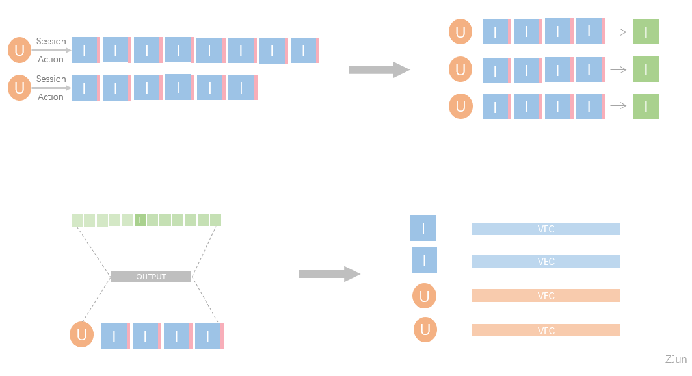
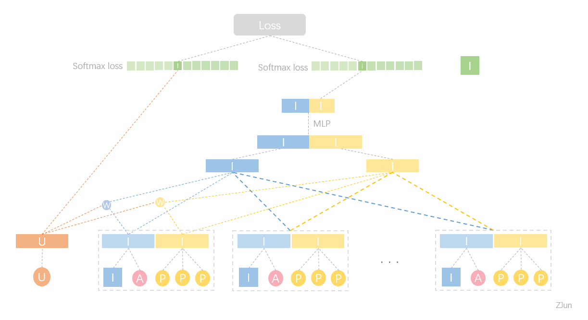

### Session And Side Info Model For Embedding

Author : ZJun 

Date : 2018-09-27

---

#### (1) 基本思路

用户的兴趣偏好通常在短期内保持一致，所以在一个行为session内交互的商品通常具有比较强的相似性和关联性。
为了捕获商品和商品之间的相似性和相关性，以及用户和商品、用户和用户之间的关系，我们将采取用户每个行为session内对商品的交互行为作为训练数据


首先我们回顾下常用的图嵌入模型：

**常见的图嵌入模型思路：**

1. 基于行为序列，在相邻出现的物品之间定义一条边，以此得到物品交互的图
2. 在图上基于一定的方式（不同的方式得到不同的模型），获取一个节点序列 
3. 将上一步获取的节点序列看作一句话，可以采用word2vec的方式训练，得到每个节点的向量表征
4. ps: LINE 是基于构建得到的图去获取节点的一阶二阶信息，希望节点向量能保留这些信息（方式不同于上述方法）

**我们将采用的方法：**

1. 我们并不是只在相邻的物品之间添加一条边，而是使用用户在一个session内前序的n的商品序列去和后一个商品构建关联（预测）
2. 前序n个商品对于后一个商品的贡献程度会由用户在训练数据期间的综合偏好来决定( attention )
3. 我们会区分对前序每一个商品交互的行为类型，不同的类型的交互行为会体现不同的贡献度( act weighted )
4. 我们可以扩展融合物品自带的一些属性 ( side info )
5. ps : 属性信息主要是为了新品准备，有大量行为的商品自身已经能学出这些属性关系）

模型示意图如下



模型结构图



#### (2) 数据准备

1. 从 session 中按时间顺序抽取商品序列和对应的行为序列
2. 对每个序列按划窗方式切分子序列，切分长度为n+1
3. 准备商品对应属性的表格

> user_name  ||   session_id || item_id_label || item_id_sequence || action_sequnece 

> item_side_info 

#### (3) 程序运行

依据 `code\prepare_data\shell_script`准备好模型所需数据

通过如下方式运行
```bash
sh get_all_data.sh 2018-09-10 

# data store at
# "/user/ai/zhangjun/YxEmbedding/yanxuan_user_action_sequence_for_model" (train_data)
# "/user/ai/zhangjun/YxEmbedding/data/item_info_data
# "/user/ai/zhangjun/YxEmbedding/data/item_side_info

```

然后直接运行`run.sh`即可，例如

```bash
# params ：epoch_num | embed_size | gpu_num | model_run_tag
nohup sh run.sh 5 128 3 eb_128_en_5 > log_eb_128_en_5 2>&1 &
```

具体详情如下

数据预处理

```bash
cd prepare_data
python3 -B -u generate_item_id_map.py
python3 -B -u generate_user_name_map.py
python3 -B -u generate_side_info_name_map.py
```

训练模型

```bash
python3 -B -u run.py -data_path ../data/  \
                  -train_data_name train_data \
                  -test_data_name test_data \
                  -embed_size 128 \
                  -layer_size_list 512,256,128 \
                  -save True \
                  -restore False \
                  -early_stop 0 \
                  -epoch 3  \
                  -skip_step 1000 \
                  -gpu_num 4 \
                  -dropout_rate 0 \
                  -regular_rate 0 \
                  -batch_size 2048 \
                  -learning_rate 0.05 \
                  # -save_tag tag_name
```

输出向量（projector）

```bash
cd show_results

# tf_projector

python3 -B -u tf_projector.py \
           -vec_file_name item_vecs \
           -meta_file_name item_metas \
           # -save_tag tag_name

python3 -B -u tf_projector.py \
           -vec_file_name side_info_item_vecs \
           -meta_file_name side_info_item_metas \
           # -save_tag tag_name

python3 -B -u tf_projector.py \
           -vec_file_name act_with_side_info_item_vecs \
           -meta_file_name act_with_side_info_item_metas \
           # -save_tag tag_name

# tf_projector_tensorboard

python3 -B -u tf_projector_tensorboard.py \
           -vec_file_name item_vecs.tsv \
           -meta_file_name item_metas.tsv \
           -vec_type act \
           # -save_tag tag_name

python3 -B -u tf_projector_tensorboard.py \
           -vec_file_name side_info_item_vecs.tsv \
           -meta_file_name side_info_item_metas.tsv \
           -vec_type side_info \
           # -save_tag tag_name
           
python3 -B -u tf_projector_tensorboard.py \
           -vec_file_name act_with_side_info_item_vecs.tsv \
           -meta_file_name act_with_side_info_item_metas.tsv \
           -vec_type act_with_side_info \
           # -save_tag tag_name

```

#### (4) 模型输出

1. 基于行为信息的用户向量
    - Vec location : `output/user_vecs` & `output/user_metas `
2. 基于行为信息并融合属性信息的商品向量 
    - Vec location : `output/item_vecs` & `output/item_metas `
3. 纯属性embeddding向量融合的商品向量 （用于新品） 
    - Vec location : `output/side_info_item_vecs` & `output/side_info_item_metas `
4. 基于行为信息得到的向量与属性信息的商品向量拼接结果 （用于tensorboard展示）
    - Vec location : `output/act_with_side_info_item_vecs` & `output/act_with_side_info_item_metas `

#### (5) 新品问题

**原始想法：（写下来，避免以后踩坑）**

手头有基于行为学到的向量V_act和基于属性的向量V_p并且有每个商品上架距离当前的时间t
 
那么可以构建函数 combine( V_act,V_p,time_decay(t)) 来获取融合的向量，这样得到的向量可以满足：
越新的商品，属性向量贡献越强

但是其实简单分析后就可以发现，这样并不能很好解决问题 ，原因如下：

通过这样方式获取的向量还是极强地保留了时间信息的影响，因为通过这样加权得到的向量很容易走向空间中的两个区域，新的商品主要分布在了属性信息的向量空间，而旧的商品主要分布在行为信息的向量空间，当我们要计算商品之间相似性的时候，新品很大概率是和属性空间附近的商品接近，这样还是没办法解决新品粘连的问题，只能区分新品局部之间的关联和差异，很难做到跨越新旧商品品的相似捕获。

**目前解决方案**

`Old` ： 对于商品，我们会保存两份向量，如第(3)章节模型输出所述 (后续可以加入更多商品自身的属性信息)

`New` ： 在模型训练阶段，我们在商品属性中融合进商品上架时间的信息，然后在获取向量供后续使用的时候合并除时间属性以外的属性，然后和基于行为学到的向量直接拼接

以上哪种方式更好有待进一步评估

#### (6) 向量评估

**【1】 物 -> 物**

评估方式：

[✔]   **关联商品推荐**

目前关注的目标是商品搭配，所以先输出一份每个商品的关联商品（去除同一二级类目的商品）的列表

note: 基于商品上架时间，近一周上架的使用商品属性信息向量计算相似关联商品

运行

```bash
python3 -B similar_item_list.py  \
            -select_num 20 \
            -filter False \
            -new_old_split_date 2018-09-01 \
            # -save_tag tag_name
           
python3 -B similar_item_list.py  \
            -select_num 20 \
            -filter True  \
            -new_old_split_date 2018-09-01 \
            # -save_tag tag_name
```

参数解释：

- `select_num` 每个商品挑选最相似的select_num个商品
- `filter` 是否过滤同一二级类目的商品
- `new_old_split_date` 新旧商品的划分节点，之前的用行为属性合并向量，之后的用纯属性向量
- `save_tag` 用来区不同训练参数的模型结果


输出结果

1. 不做过滤操作的：`eval/item2item/similar_result`
2. 过滤同一二级类目：`eval/item2item/similar_result_filter`

**【2】 物 -> 人**

评估方式：

[✔] **找相关用户的能力**

基于用户和商品的向量，为种子商品计算最接近的部分用户，然后计算这些用户后续交互的商品与种子商品之间的相似度

数据准备

基于`eval/future_user_interact_item.sh`获取用户未来的交互数据

运行

```bash
python3 -B item2user_eval.py  \
            -select_num 20 \
            -top 5 \
            -new_old_split_date 2018-09-01 \
            # -save_tag tag_name
python3 -B item_base_similar.py \
            -top 5 \
            -new_old_split_date 2018-09-01 \
            # -save_tag tag_name
```

参数解释：

- `select_num` 每个物品挑选最相似的select_num个用户
- `top` 用户在未来交互的所有商品与种子商品计算得到的相似值的top个
- `new_old_split_date` 新旧商品的划分节点，之前的用行为属性合并向量，之后的用纯属性向量
- `save_tag` 用来区不同训练参数的模型结果

输出结果

1. 最终的相似得分的均值: `eval/item2user/item2user_similar_result` 
2. [供参考] 每个商品选择最接近的top商品，计算相似得分: `eval/item2user/item_base_similar_score` 

|  model |  item2user | reference  | modify item2user|
|--------|------------|------------|-----------------|
|  line  |   0.2551   |   0.6305   |      0.404      |
|   sas |   **0.6739**   |   **0.9258**   |      **0.7279**     |


**【3】 人 -> 物**

评估方式：

[✔] **找感兴趣商品的能力**

基于用户和商品的向量，为种子用户计算最接近的部分商品，然后计算种子用户后续交互的商品与相似计算推测的商品之间的相似度

数据准备

基于`eval/future_user_interact_item.sh`获取用户未来的交互数据

运行

```bash
python3 -B user2item_eval.py \
            -select_num 20 \
            -top 20 \
            # -save_tag tag_name
```

参数解释：

- `select_num` 每个用户挑选最相似的select_num个商品
- `top` 用户在未来交互的所有商品与计算得到的最相似的select_num个商品计算得到的相似值的top个
- `save_tag` 用来区不同训练参数的模型结果


输出结果

1. 最终的相似得分的均值: `eval/user2item/user2item_similar_result`

|  model |  user2item | reference  | modify user2item|
|--------|------------|------------|-----------------|
|  line  |   0.3114   |   0.6305   |      0.4938     |
|  sas   |   **0.8101**   |   **0.9258**   |      **0.8750**     |


**【4】 人 -> 人**

评估方式：

[ ] **找相关用户**

基于用户和商品的向量，为种子用户计算最接近的部分用户，然后计算种子用户后续交互的商品与相似用户交互的商品之间的相似度


